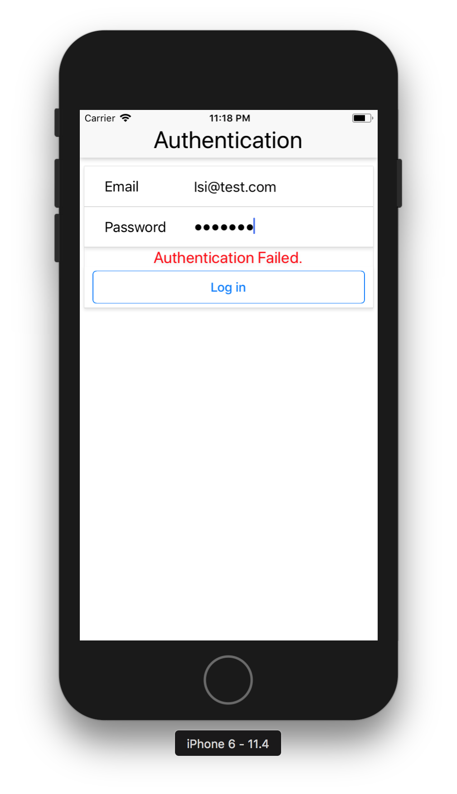
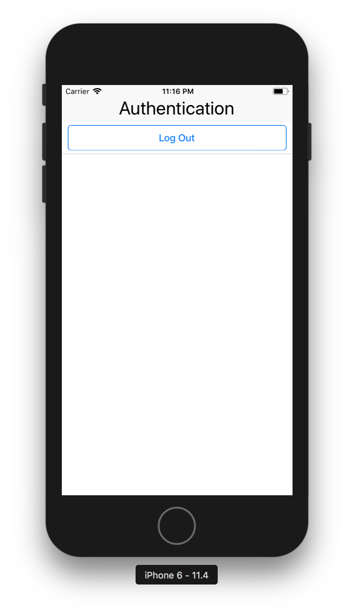

A project from udemy's [The Complete React Native and Redux Course](https://www.udemy.com/the-complete-react-native-and-redux-course/learn/v4/overview)

I've made an authorization page with using react-native and firebase.

### Log In Form

### While Checking

### Failed Attempt

### Log Out Page

